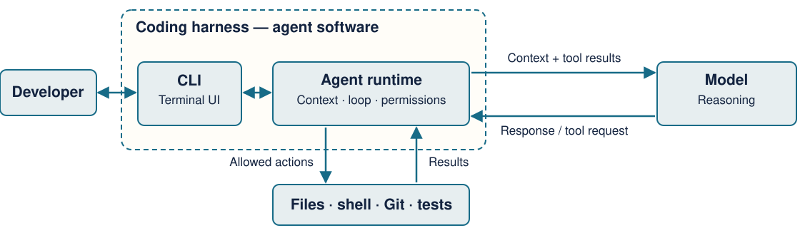

<!-- _class: lead -->

# From AI Chat to Agentic Development

CLI agents, hooks, subagents, specs, durable context, skills, and parallel Git workflows

**Module 03 · CAP**

<!--
Bridge from Week 2: students already practiced prompts, context, reusable skills, review, validation, and keeping a human in the loop. This module moves the agent into the terminal and introduces more deliberate delegation and persistent engineering artifacts.
-->

---

# Today’s goal

By the end of this module, you should be able to:

1. Explain **why terminal-native coding agents differ from chat assistants**.
2. Use **hooks, subagents, skills, and project instructions** intentionally.
3. Turn a feature idea into **goal → spec → plan → tasks → implementation**.
4. Preserve context so another session—or another AI—can continue safely.
5. Use **Git worktrees** to isolate parallel agent work.
6. Familiar with popular skills like /review, /simplify, /loop, /commit, push, and open a PR.

---

<!-- _class: compact -->

# Building on Week 2

## What we practiced

- Clear prompts and useful context for an AI agent.
- Project instructions, agents, and reusable skills.

## What we add today

- **Terminal workflows and hooks** for repeatable actions and checks.
- **Specs, plans, and tasks** to organize a feature from idea to PR.
- **Saved project state and Git worktrees** to resume and isolate work.

We keep using prompts, context, review, and verification throughout.

<!--
Week 2 already used agents, subagents, skills, and a live application build. Describe today's additional practices without suggesting that agentic work or delegation starts in Week 3. These practices also apply outside the terminal.
-->

---

<!-- _class: dark -->

# 1. AI Coding in the CLI

A chat assistant can **tell you** what to do.

A terminal coding agent can often **inspect, act, run, observe, and iterate** inside the repository.

---

# What is a CLI?

**CLI = Command-Line Interface.** You interact with software by typing commands in a terminal instead of clicking a graphical interface.

```text
$ git status
$ yarn test
$ claude
$ codex
```

For AI coding, the terminal matters because it sits next to the tools engineers already use: **files, Git, package managers, test runners, linters, build tools, and GitHub**.

> The terminal is not “better because it is old-school.” It is useful because it is a universal control surface for software engineering tools.

---

# Chat window vs. coding agent

| Desktop/web chat | Terminal coding agent |
|---|---|
| You paste or upload context | Agent can inspect repository files |
| Usually proposes code | Can edit files directly |
| You run commands | Can run tests/build/lint commands |
| You report errors back | Can observe command output itself |
| Git context is manual | Can inspect diffs, branches, history |
| Mostly one request/response loop | Can execute a multi-step loop |

**Key difference:** access to tools creates a feedback loop.

`understand → change → run → observe → correct`

---

# Why CLI agents are powerful for software engineering

1. **Repository-scale context** — search the codebase instead of pasting snippets.
2. **Action** — edit files, run scripts, invoke Git, inspect logs.
3. **Verification** — tests and runtime behavior can challenge the model’s assumptions.
4. **Repeatability** — skills, hooks, scripts, and project instructions become reusable.
5. **Parallelism** — separate agents can work in separate worktrees.
6. **Less context switching** — the agent operates where the engineering evidence already lives.

**But:** access to tools also increases risk. A wrong answer becomes more consequential when it can execute commands.

---

# A useful mental model: agent = model + tools + loop

```text
                ┌──────────────┐
   Goal ───────▶│    Model     │
                └──────┬───────┘
                       │ chooses action
                       ▼
        ┌─────────────────────────────┐
        │ Files · Shell · Git · Tests │
        └──────────────┬──────────────┘
                       │ returns evidence
                       ▼
                ┌──────────────┐
                │    Model     │
                └──────────────┘
```

The model is still probabilistic. **Tools provide evidence; they do not guarantee good judgment.**

---

# Claude Code and Codex CLI

You only need **one** installed for this course.

| | Claude Code | Codex CLI |
|---|---|---|
| Start | `claude` | `codex` |
| Project instructions | `CLAUDE.md` | `AGENTS.md` |
| Reusable workflows | Skills | Skills |
| Specialized workers | Subagents | Subagents |
| Hooks | Yes | Yes |
| Git/shell/files | Yes | Yes |

**Today’s live demo uses Claude Code**, while we point out Codex equivalents where useful.

*Installation is in the separate pre-class setup guide.*

---

<!-- _class: compact -->

# Git and GitHub use different CLIs

| Command | What it manages |
|---|---|
| `git` | Local branches, commits, and syncing code with remotes |
| `gh` | GitHub issues, pull requests, and other hosted repository features |

Claude Code and Codex run these commands in your shell. They use **your GitHub CLI login and permissions**; there is no separate AI GitHub login.

```bash
gh auth login
gh auth status
gh repo set-default YOUR_USERNAME/excalidraw
```


<div class="source">GitHub CLI: <a href="https://cli.github.com/manual/gh_auth_login">authentication</a> · <a href="https://cli.github.com/manual/gh_repo_set-default">default repository</a></div>

---

<!-- _class: compact -->

# Resume a CLI session

Return to a saved conversation from the **same repository/worktree**.

| From your terminal | Claude Code | Codex CLI |
|---|---|---|
| Continue the latest session here | `claude --continue` | `codex resume --last` |
| Choose a saved session | `claude --resume` | `codex resume` |
| Resume a specific session | `claude --resume SESSION_ID` | `codex resume SESSION_ID` |

Inside either CLI, use **`/resume`** to choose a saved conversation.

- Resume loads the conversation; it does **not** restore files or restart the app.
- Check the branch, `git status`, and diff: the repository may have changed.
- New session or different CLI? Rebuild context from saved project artifacts.

<div class="source">Sources: <a href="https://code.claude.com/docs/en/common-workflows#resume-previous-conversations">Claude Code sessions</a> · <a href="https://learn.chatgpt.com/docs/developer-commands?surface=cli">Codex CLI commands</a></div>

<!--
SESSION_ID is a placeholder: copy an actual saved session ID. Demonstrate the picker, then inspect Git state. Resuming restores conversation history; it does not roll files back or transfer a session to another CLI. Codex's default picker and --last filter by the current directory; --all searches across directories. The later durable-context section covers recovery when session history is unavailable or unsuitable.
-->

---

<!-- _class: compact -->

# Choose the model and reasoning effort

**Model:** which AI does the work; capability, speed, and cost differ.

**Effort:** how much reasoning it invests; higher levels can take more time and tokens.

| In an active session | Claude Code | Codex CLI |
|---|---|---|
| Select a model | `/model` | `/model` |
| Adjust reasoning effort | `/effort` or the `/model` slider | Effort selection within `/model`, when available |

- **Routine work:** try a faster model or lower effort; verify the result.
- **Hard debugging or design:** favor capability; raise effort when it helps.
- Start at the model's default effort; adjust based on correctness and total time.

More effort cannot replace missing context or verification.

Model access and effort levels vary by model, account, and CLI version.

<div class="source">Sources: <a href="https://code.claude.com/docs/en/model-config">Claude model configuration</a> · <a href="https://learn.chatgpt.com/docs/developer-commands?surface=cli">Codex model picker</a></div>

<!--
Use the live picker's available models rather than teaching a fixed ranking. Model capability and reasoning effort are separate choices: increasing effort does not switch to a different model. The same effort label is not a standardized compute budget across providers/models. Compare correctness and total time, including retries, rather than response speed alone. Show the active model/effort after changing it; in Codex, /status reports the active configuration. Startup examples in reference.md: claude --model sonnet --effort high; codex --model MODEL_ID (replace the placeholder with an available model). The sonnet alias is an example, not a course requirement or a promise of a specific model version.
-->

---

<!-- _class: compact -->

# Plan mode: agree before implementing

**Plan mode** separates investigating an approach from carrying it out.

| CLI | Enter planning mode |
|---|---|
| Claude Code | `Shift+Tab` until Plan appears, or start with `claude --permission-mode plan` |
| Codex CLI | `/plan` or `/plan Add keyboard navigation for frames` |

1. **Investigate:** inspect relevant files and clarify requirements.
2. **Propose:** identify changes, tradeoffs, implementation steps, and checks.
3. **Review:** correct the plan, then switch to implementation when ready.

Use it for unfamiliar code, changes across several files, or uncertain requirements.

**Planning mode ≠ reasoning effort.** It changes the workflow; effort changes how much reasoning the model invests.

<div class="source">Sources: <a href="https://code.claude.com/docs/en/permission-modes#analyze-before-you-edit-with-plan-mode">Claude Plan mode</a> · <a href="https://learn.chatgpt.com/docs/developer-commands?surface=cli">Codex /plan</a></div>

<!--
Show the active mode before entering the task. Claude Code can also enter planning via /plan. Its source edits are normally blocked until plan approval; it can write a plan and run permitted exploration commands. Do not describe this as an OS-level read-only sandbox: command permissions and bypass settings still matter. Codex /plan requests an implementation plan before implementation begins; do not assume its enforcement is identical to Claude's permission mode. Review scope, affected files, assumptions, and validation before leaving planning. An approved plan still needs tests and diff review during execution.
-->

---

<!-- _class: compact -->

# Planning in chat vs. the CLI

**Yes, chat can help you plan.** Ask for options, missing requirements, steps, and tests before requesting code.

| | Ordinary chat without repository tools | CLI agent in your repository |
|---|---|---|
| Context | Your description and shared files | Can inspect the current checkout and project instructions |
| Investigation | Reasons from the supplied material | Can search code and use permitted diagnostic tools |
| Next step | You carry the plan into a coding environment | Review the plan, then continue implementation in that environment |

**Dedicated Plan modes also exist outside the terminal**, including Claude Code's desktop Code tab and web interface.

Compare **repository access, tools, and planning/approval controls**. A graphical agent with the same access can support a similar workflow.

<div class="source">Sources: <a href="https://code.claude.com/docs/en/permission-modes#switch-permission-modes">Claude desktop/web modes</a> · <a href="https://learn.chatgpt.com/docs/prompting">Planning with project context</a></div>

<!--
“Chat” is ambiguous: a text conversation without repository tools differs from a coding agent presented as a chat. The table deliberately compares the former with a CLI agent. Do not equate Claude's ordinary Chat tab with its Code tab, or infer that every web chat offers a dedicated Plan switch. Asking for a plan is a prompting technique; a product's named Plan mode adds workflow controls whose exact behavior varies. Neither the terminal nor a mode label guarantees a correct plan.
-->

---

# Tool access is not permission to stop thinking

Before letting an agent act, decide:

- **What can it change?** Which files/directories are in scope?
- **What can it run?** Tests are low-risk; destructive shell commands are not.
- **What must it never touch?** Secrets, production data, credentials, deployment settings.
- **What needs explicit review?** Architecture changes, dependency additions, schema migrations.
- **What evidence is required before “done”?** Tests, lint, build, manual behavior, diff review.


---

<!-- _class: compact -->

# “YOLO mode”: fewer approval stops

**YOLO = “You Only Live Once.”** In coding-agent slang, it means bypassing execution safeguards so the agent can act with fewer interruptions.

| Command | What it bypasses |
|---|---|
| `claude --dangerously-skip-permissions` | Routine permission checks; explicit restrictions remain |
| `codex --yolo` | Approval prompts **and Codex's sandbox** |

**Why use it?** Long runs, batch changes, and test/fix loops can continue without repeated approval stops.

**The tradeoff:** unintended actions can affect files, credentials, and services before you review them.

Prefer scoped permissions. Reserve bypass for an isolated environment with tightly limited access.

**A Git branch or worktree is not a security sandbox.**

<div class="source">Sources: <a href="https://code.claude.com/docs/en/permission-modes#skip-all-checks-with-bypasspermissions-mode">Claude bypass mode</a> · <a href="https://learn.chatgpt.com/docs/agent-approvals-security">Codex approvals and sandbox</a></div>

<!--
These are explanatory examples, not a required classroom configuration. Codex --yolo aliases --dangerously-bypass-approvals-and-sandbox. Distinguish approval policy (when the tool asks) from sandbox boundaries (what it can reach). Codex --ask-for-approval never can retain a configured sandbox, so “no prompts” alone does not imply YOLO. Claude's flag selects bypassPermissions; explicit deny/ask rules and some other checks still apply. Do not claim that this flag grants OS administrator rights or removes an external container/VM boundary. A container only helps if its mounts, credentials, and network access are appropriately limited. Tests and final diff review remain necessary, and Git cannot undo an external side effect. Discuss the tradeoff without launching either bypass command on the classroom machine.
-->

---

<!-- _class: compact -->

# What is a coding harness?

A **coding harness** is the software that runs a model's coding workflow.



- **Model:** reasons about the task and proposes responses or tool calls.
- **Harness:** manages context, the execution loop, tools, permissions, and sessions.
- **CLI:** the terminal interface you use to direct that system and see its progress.

<div class="source">Further reading: <a href="https://www.anthropic.com/engineering/effective-harnesses-for-long-running-agents">Effective harnesses for long-running agents</a></div>

<!--
This is a conceptual diagram, not the exact process architecture of either product. A model may run remotely; the harness sends it context and receives text or structured tool requests. The harness checks and dispatches permitted actions, then provides their results to the next model call. A coding CLI such as Claude Code or Codex includes more than its visible terminal interface: it supplies agent software around the selected model. Graphical interfaces can use the same kind of runtime. Model choice affects reasoning; harness design affects what context, actions, persistence, and feedback are available. Diagram source: assets/coding-harness.mmd; slide-ready rendering: assets/coding-harness.svg.
-->

---

<!-- _class: dense -->

# MCP: connect a CLI agent to outside tools

**MCP** standardizes how AI clients connect to external tools and information.

```text
CLI client  ⇄  MCP server  ⇄  docs, GitHub, Figma, monitoring
```

**Why:** reusable integrations. **Examples:** docs, GitHub, Figma, monitoring.

**Example: add the read-only OpenAI docs server**

```bash
claude mcp add --transport http openai-docs https://developers.openai.com/mcp
codex mcp add openaiDeveloperDocs --url https://developers.openai.com/mcp
```

Use `/mcp` to inspect servers and tools. Authenticate if prompted; review access.

<div class="source">Sources: <a href="https://modelcontextprotocol.io/introduction">MCP overview</a> · <a href="https://code.claude.com/docs/en/mcp">Claude Code MCP</a> · <a href="https://learn.chatgpt.com/docs/extend/mcp">Codex MCP</a></div>

<!--
Both add commands register the read-only OpenAI developer documentation server. In a real project, only connect a server you trust, follow its authentication instructions, and inspect its exposed capabilities before granting access. MCP does not guarantee every connected operation is read-only. Check command names against current CLI documentation.
-->

---

<!-- _class: compact -->

# 2. Hooks: actions triggered by events

A **hook** runs a configured action automatically when a matching event occurs in the agent's workflow.

**Event occurs → harness matches the hook → configured action runs**

| When it triggers | How it can be used |
|---|---|
| Before a tool runs | Check whether an action is allowed |
| After a file edit | Run a formatter or lint check |
| When work finishes | Send a notification |

You configure **which event to watch** and **what action to run**. The harness triggers it; the model does not have to remember to ask.

See the Appendix for the configuration and practical guidance.

<!--
Teach the event/action pattern, not a list of every lifecycle event. Matchers can narrow a hook to particular tools. Exact event names and configuration vary by CLI; the next slide uses Claude Code. Implementation details and operational guidance are in the Appendix.
-->

---

<!-- _class: compact -->

# Hook example: lint after an edit

**Goal:** run a code check automatically after Claude changes a file.

| Part | Example |
|---|---|
| Event | `PostToolUse` — after a tool succeeds |
| Match | `Edit` or `Write` |
| Action | Run the project's lint-check script |

1. Claude edits a file using a matching tool.
2. The harness runs the configured script.
3. The result gives the agent feedback for its next step.

**A check reports problems; it does not guarantee they are fixed.**

<!-- This is an example, not a claim that a hook is installed. The script must exist and report useful results. PostToolUse runs after the edit; it does not prevent or undo it. -->

---

<!-- _class: compact -->

<!-- _class: dark -->

# 3. Agents & Subagents — Revisited

Delegation is useful when it creates **focus, isolation, or parallelism**.

---

# Agent vs. subagent

**Main agent**  
Owns the overall goal, coordinates work, and maintains the primary conversation.

**Subagent**  
A specialized worker that receives a narrower task, works in its own context, and returns a result or summary.

```text
Main agent
├── Codebase explorer
├── Implementation worker
├── Test investigator
└── Code reviewer
```
Why use one?

- isolate noisy exploration / specialize instructions/tools
- parallelize independent work / keep the main context focused

---

# Subagents are not automatically better

Use a subagent when the task is **large enough to justify coordination**.

### Good delegation

“Inspect how viewport state and selection zoom are implemented. Return relevant files, symbols, constraints, and risks. Do not edit.”

### Poor delegation

“Rename this one local variable.”

Costs of subagents:

- additional tokens and latency / coordination overhead / possible duplicate exploration / summaries can omit important detail / concurrent edits can conflict

> Parallelism helps most when tasks have **clear boundaries and separate working directories**.

---

# Example: divide a feature without losing control

**Goal:** add Selection Focus Mode to Excalidraw.

| Worker | Mission | Output |
|---|---|---|
| Explorer | Find selection, zoom, overlay, action patterns | file/symbol map + risks |
| UX reviewer | Compare Zen/View Mode and avoid duplication | UX constraints |
| Implementer | Build against approved spec | code + tests |
| Reviewer | Inspect diff for bugs/regressions | findings with evidence |

The main agent should combine the evidence—**not blindly accept every worker’s conclusion**.

---

<!-- _class: dark -->

# 4. Spec-Driven Development

The AI should not invent the product while simultaneously implementing it.

---

# What is spec-driven development?

A **specification** makes the intended behavior explicit before implementation.

```text
Idea
  ↓
Plan mode: explore + compare approaches
  ↓
Goal
  ↓
Specification
  ↓
Codebase exploration
  ↓
Implementation plan
  ↓
Tasks
  ↓
Build + verify + review
```

The purpose is not bureaucracy. It is to **separate decisions**:

- What should exist?
- How should it fit this codebase?
- What exact work should happen next?

---

# Step 1 — Goal: define the finish line

A useful goal answers:

- **Problem:** what user pain or missing capability are we addressing?
- **Outcome:** what should the user be able to do?
- **Success:** what observable behavior proves it works?
- **Boundaries:** what are we explicitly *not* building?

Example:
> Allow a user to select diagram elements and temporarily focus on them by fitting the selection to the viewport and de-emphasizing other elements. Exiting Focus Mode restores normal editing.

A goal is intentionally shorter than a full spec.

---

# Step 2 — Spec: define behavior before code

A practical feature spec can contain:

```markdown
# Feature: Selection Focus Mode
## Problem
## Goals
## Non-goals
## User experience
## Functional requirements
## Edge cases
## Accessibility / keyboard behavior
## Technical constraints
## Acceptance criteria
```

**Acceptance criteria should be observable.**  
Weak: “Focus Mode works well.”  
Strong: “When 2+ elements are selected and Focus Mode starts, the viewport fits the selection and non-selected elements are visually de-emphasized.”

---

# Step 3 — Explore *before* planning

Do not ask the AI for an implementation plan before it understands the codebase.

**Exploration prompt:**

> Read the spec. Do not edit. Identify the existing patterns for actions, selection state, zoom-to-selection, overlays/status UI, keyboard shortcuts, tests, and localization. Compare this request with existing View Mode. Return the smallest set of files likely involved.

Why this matters:

- avoids imaginary architecture / reveals reusable primitives
- identifies conflicts with existing behavior / makes the plan repository-specific

---

# Step 4 — Plan: explain how this repo will change

A plan should connect requirements to code:

```markdown
# PLAN.md
1. Add action/state needed for Focus Mode.
2. Reuse existing zoom-to-selection logic.
3. Render dimming/status UI using existing UI patterns.
4. Add exit behavior + shortcut handling.
5. Add localization strings.
6. Add tests for enter/exit/selection edge cases.
7. Run typecheck, lint, focused tests, and manual browser check.
```

A good plan names likely files/symbols and explains **why** they need to change.

---

# Step 5 — Tasks: make progress observable

Convert the plan into small, checkable work:

```markdown
# TASKS.md
- [x] Map relevant action/viewport code.
- [ ] Add Focus Mode state/action.
- [ ] Add visible Exit Focus control.
- [ ] Dim non-focused elements.
- [ ] Add keyboard behavior.
- [ ] Add/update tests.
- [ ] Run checks and manual verification.
- [ ] Review and simplify diff.
- [ ] Commit, push, PR.
```

Tasks help humans and agents answer: **What is done? What remains? What is blocked?**

---

# Context should live with the project

Chat history is useful—but fragile.

For longer work, persist the important state in Markdown:

```text
docs/ai/
├── SPEC.md
├── PLAN.md
├── TASKS.md
├── PROGRESS.md
└── DECISIONS.md
```

Small project? One `PROJECT_CONTEXT.md` is enough.

Store **decisions and evidence**, not a transcript of everything the AI said.

---

# What belongs in PROJECT_CONTEXT.md?

```markdown
# Project Context
## Goal
## Current status
## Completed work
## Decisions and rationale
## Files changed / important symbols
## How to run and test
## Known issues / risks
## Next task
## Last verified commit
```

Two high-value rules:

1. Update it at **meaningful steps**, not after every keystroke.
2. Record what was **verified** separately from what is only assumed.

---

# Session recovery is a feature of your process

Imagine your terminal closes after 40 minutes.

### Bad recovery

> “We were working on that feature… I think we changed some viewport stuff. Continue.”

### Strong recovery

> “Read `SPEC.md`, `PLAN.md`, `TASKS.md`, and `PROJECT_CONTEXT.md`. Inspect `git status` and the current diff. Confirm what is implemented and what remains. Do not change code until your understanding matches the stored context.”

The new session reconstructs state from **repository evidence**, not memory.

---

# Cross-agent handoff: Claude → Codex (or the reverse)

Durable context should not depend on one vendor’s conversation history.

```text
Claude session
    │ updates
    ▼
SPEC / PLAN / TASKS / CONTEXT + Git diff
    │
    ▼
Codex session
    │ reads + verifies
    ▼
Continues from the same engineering artifacts
```

This is **not** proof that two agents will make identical decisions. It is a way to make the project state inspectable and transferable.

---

# Skills: reusable procedures, not magic prompts

A **skill** packages a repeatable workflow so you do not rewrite the same multi-step instruction every time.

Course-provided skills for today’s demo (install separately):

| Skill | Purpose |
|---|---|
| `/goal` | turn the idea into a clear finish line |
| `/code-review` | inspect diff + evidence for defects/regressions |
| `/simplify` | remove needless complexity without changing behavior |
| `/commit-push-pr` | verify, commit, push, and open a clean PR |

**Skill ≠ agent.** A skill is reusable guidance; a subagent is a separate worker/context.

---

# Git worktrees: parallel work without directory collisions

A **worktree** gives another branch its own working directory while sharing the same Git repository history.

```text
excalidraw/                 master
../excalidraw-focus/        feature/focus-mode
../excalidraw-review/       review/focus-mode
```

Why it matters for agents:

- each agent can have its own files + branch / no constant branch switching
- less risk of one agent overwriting another’s uncommitted work
- easy to compare parallel approaches

**Branches isolate history. Worktrees also isolate the working directory.**


---

<!-- _class: lead -->

# Live Demo: Excalidraw

One of two interchangeable scenarios

**A. Selection Focus Mode**  
**B. Frame Presentation Mode**

---

<!-- _class: compact -->

# Demo A — Selection Focus Mode

**Existing Excalidraw already has Zen Mode and View Mode. This feature must be different.**

### User outcome
Select one or more elements → enter **Focus Mode** → selection fills the viewport while unrelated elements are visually de-emphasized → exit returns to normal editing.

### Acceptance criteria

- available only when a selection exists
- reuses existing zoom-to-selection behavior where possible
- non-selected content is dimmed, not deleted/hidden from the scene data
- obvious **Exit Focus** control and keyboard exit
- selection changes while focused are handled predictably
- existing Zen Mode/View Mode behavior remains unchanged
- tests + typecheck/lint + manual browser validation

---

<!-- _class: compact -->

# Demo B — Frame Presentation Mode

### User outcome
Turn existing Excalidraw frames into a lightweight presentation: start presentation → show one frame fitted to the viewport → next/previous → slide counter → exit.

### Acceptance criteria

- presentation starts only when frames exist
- deterministic frame order is defined in the spec
- current frame fits the viewport
- next/previous keyboard navigation
- visible `n / total` indicator + exit control
- editing UI/interactions are appropriately constrained while presenting
- exiting restores the prior editor state
- existing View/Zen Mode behavior is not broken
- tests + typecheck/lint + manual browser validation

---

# Follow the live demo: branch and explore

1. **Create a feature branch in your own fork.** Run `git status -sb`, then `git switch -c feature/<demo-name>`.
2. **Start the app.** Run `yarn start` in one terminal and open the URL it prints.
3. **Start Claude in Plan mode.** Run `claude --permission-mode plan` in your clone. Codex users run `codex`, then enter `/plan`.
4. **Compare approaches from the code.** Use the prompt below. Claude reads with `Read` and searches through `Bash`; Codex can use its shell tools.

```text
Read the feature idea below. Search the repository for the relevant existing
patterns. Compare two or three approaches and cite files/symbols, tradeoffs,
likely files, and tests. Recommend one approach. Do not edit files.
[Paste the Focus Mode or Frame Presentation Mode idea from the slide before.]
```

<!--
Choose one feature and lead the class through each command and prompt. Students use their own fork, clone, and feature branch. Pause after each step so everyone can follow. If a step fails, debug it together from the output and repository evidence.
-->

---

<!-- _class: compact -->

# Follow the live demo: define behavior

5. **Choose an approach; leave Plan mode.** Claude: press `Shift+Tab` until **Manual** appears. Codex: use its mode control and confirm Plan is off.

6. **Write the goal.** Paste the chosen approach into this prompt:

```text
Create docs/ai/GOAL.md for this feature. State the problem, user outcome,
observable success criteria, non-goals, and constraints. Only write this file;
do not change application code.
```

7. **Write the spec.** Review GOAL.md together, then ask:

```text
Expand docs/ai/GOAL.md into docs/ai/SPEC.md. Include observable acceptance
criteria, edge cases, keyboard/accessibility behavior, and compatibility
constraints. Only write SPEC.md; do not change application code.
```

---

<!-- _class: compact -->

# Follow the live demo: explore and plan

8. **Map existing code.** Ask a focused subagent to inspect the spec. If subagents are unavailable, ask the main agent to do the same without edits.

```text
Read docs/ai/SPEC.md. Find existing code patterns and tests that apply. Return
file paths, symbols, evidence, and risks. Do not edit.
```

9. **Write the plan and task list.** Review the exploration first, then ask:

```text
Using SPEC.md and the exploration evidence, create docs/ai/PLAN.md and
TASKS.md. Map each step to files and a verification check. Keep the scope small.
Only create or update these planning documents; do not implement application code.
```

---

<!-- _class: compact -->

# Follow the live demo: implement and observe

10. **Implement one reviewed task at a time.** Keep the app running; watch the browser as behavior appears.

```text
Implement the next approved task in docs/ai/TASKS.md. Keep changes within
SPEC.md, update TASKS.md, and run the focused check for this change. Show me the
result and any failure before continuing.
```

11. **Try the feature in the browser.** Focus Mode: select elements, enter focus, then exit. Presentation Mode: start, navigate frames, and exit. Compare behavior with SPEC.md.

12. **If something fails, debug together.** Read the error, reproduce it, inspect the relevant code, then ask:

```text
The feature does not meet this criterion: [criterion]. The observed result is
[what happened]. Inspect the relevant code and output, explain the likely cause,
and propose the smallest fix. Do not edit until we agree on the diagnosis.
```

---

<!-- _class: compact -->

# Follow the live demo: review and finish

13. **Review the diff.** Ask for evidence-based findings against the spec:

```text
Review the current diff against docs/ai/SPEC.md. Find defects, regressions,
missing tests, and unnecessary scope. Cite file/symbol evidence. Do not edit.
```

14. **Simplify, then verify.** Apply agreed fixes and rerun the focused checks:

```text
Preserve SPEC.md behavior. Identify unnecessary state, duplication, or custom
logic. Explain the smallest safe simplification before applying it. Then rerun
the relevant checks and report actual results.
```

15. **Save handoff and PR notes.** Record decisions, current status, checks actually run, remaining risks, and next step in `docs/ai/PROJECT_CONTEXT.md`; draft `docs/ai/PR_BODY.md`.

16. **Review Git state before publishing.** Stage only reviewed files, commit, and push your branch:

```bash
git status -sb
git diff --stat
git add -p
git diff --cached
git commit -m "feat: add demo feature"
git push -u origin HEAD
```

Create the pull request on your own fork:

```bash
gh pr create --repo YOUR_USERNAME/excalidraw --base master \
  --head YOUR_USERNAME:YOUR_BRANCH --title "Demo: feature prototype" \
  --body-file docs/ai/PR_BODY.md
```

Replace the uppercase placeholders with your GitHub username and branch. Do not target the official Excalidraw repository.

---

<!-- _class: compact -->

# Debug the live run together

When a step fails, keep the failure visible and work from evidence:

1. Read the exact error or unexpected browser behavior.
2. Reproduce it and identify the relevant acceptance criterion.
3. Ask the agent to inspect the relevant code and explain a likely cause.
4. Agree on one small change; apply it and rerun the focused check.
5. Update the spec or task list if the evidence changes the intended behavior.

Students investigate and apply the fix on their own machines alongside the instructor.

# The final loop

```text
Goal -> Spec -> Explore -> Plan + Tasks -> Implement -> Run + Observe -> Review -> Simplify -> Verify acceptance criteria -> Update context
 ↓
Commit → Push → PR
```

The important habit is **evidence at every transition**.

---

<!-- _class: lead -->

# Bonus 1 — How coding models are benchmarked

A benchmark is a **measurement setup**, not a universal truth about “which model is best.”

---

# SWE-bench: can an agent fix real repository issues?

SWE-bench-style evaluations give an agent a real software issue and repository state, then judge whether its patch satisfies tests.

What it tries to measure:

- repository understanding
- bug localization
- multi-file editing
- implementation correctness
- test-driven completion

---

# Terminal-Bench: can the agent operate in a terminal?

Terminal-Bench evaluates longer-horizon tasks in command-line environments.

It can test whether an agent can:

- inspect an unfamiliar environment
- use shell tools correctly
- edit/configure systems
- recover from errors
- coordinate multiple steps
- finish with machine-checkable results

**A Terminal-Bench score measures more than the base model.** The harness, tools, prompting/scaffolding, environment, and verification loop all affect results.

---

<!-- _class: compact -->

# Example cross-vendor coding benchmark table

*Illustrative comparison from Meta’s Muse Spark 1.3 model page; vendor-reported, not an independent ranking.*

| Benchmark | Meta Muse Spark 1.3 (max) | OpenAI GPT-5.6 Sol (max) | Anthropic Opus 5 (max) |
|---|---:|---:|---:|
| DeepSWE v1.1 | 75.4 | 73.0 | 74.0 |
| SWEAtlas CodeBase QnA | 59.4 | 53.5 | 52.7 |
| Terminal-Bench 2.1 | 88.8 | 88.8 | 86.7 |


*Source: dev.meta.ai/models/muse-spark, accessed Sep. 25, 2026.*


---

<!-- _class: lead -->

# Bonus 2 — Boris Cherny & the origin of Claude Code

Why a “temporary” terminal prototype became a major coding interface

---

# Boris Cherny: the accidental origin story

Boris Cherny, now **Head of Claude Code at Anthropic**, describes Claude Code’s origin as highly accidental:

1. He wanted to learn Anthropic’s public API.
2. He built a minimal chat app in the terminal because it was the fastest interface to prototype.
3. He gradually gave it tools to read/write files and execute shell commands.
4. The terminal was supposed to be a starting point—not necessarily the final product.
5. Early models were not strong enough for it to write most of his code; Anthropic built for models expected **six months later**.

The product evolved from **chat in a terminal → tool-using coding agent**.

---

# Why did the terminal form factor work so well?

From Cherny’s interviews, several reasons recur:

- **Fast to build and evolve** while models changed rapidly.
- Engineers already live near shell tools, files, Git, and build systems.
- Text input/output is composable with existing developer workflows.
- The interface stayed thin while model capability improved underneath it.
- Tool use made the experience agentic without requiring a giant IDE-specific UI.

> The surprising part, Cherny has said, is that the terminal was expected to be the beginning—and it remained central.

---

# Boris Cherny’s reported workflow: parallel + verify

In a Jan. 2026 public workflow description, Cherny reported:

- about **5 local Claude Code sessions** in parallel
- roughly **5–10 web sessions** as well
- separate Git checkouts to reduce conflicts
- frequent handoff between local/web work
- rigorous verification rather than accepting every run
- abandoning some sessions when the direction was wrong

**Teaching point:** high parallelism only works when work is isolated, outcomes are reviewable, and bad branches can be discarded cheaply.

For this course, we use **Git worktrees** as a clean isolation mechanism.

---

# Reusable workflows he popularized

Cherny’s public examples and interviews repeatedly emphasize turning repeated work into reusable procedures. Commonly discussed patterns include:

- **commit / push / PR** workflow
- **feature development** workflow
- **simplify after implementation**
- parallel/batch work when tasks are independent
- persistent repository guidance such as `CLAUDE.md`
- subagents for focused investigation or parallel work

Do not copy a workflow because a famous engineer uses it. Copy the **principle**: when you repeat a multi-step procedure, make it explicit, inspectable, and reusable.

---

<!-- _class: compact -->

# Boris Cherny: good material to follow

### X
**@bcherny** — https://x.com/bcherny

### Recommended videos / interviews

1. **Inside Claude Code With Its Creator Boris Cherny** — Y Combinator, Feb. 17, 2026  
   https://www.youtube.com/watch?v=PQU9o_5rHC4
2. **Why Coding Is Solved, and What Comes Next — Boris Cherny** — Sequoia AI Ascent 2026  
   https://www.youtube.com/watch?v=SlGRN8jh2RI
3. **Claude Code Live: Origin Story, Live Demos, & Best Practices** — Anthropic, Mar. 27, 2025  
   https://www.anthropic.com/webinars/claude-code-live
4. **Building Claude Code with Boris Cherny** — The Pragmatic Engineer interview (2026)

Watch for **workflow and design decisions**, not just productivity claims.

---

# What to take with you

1. **Move context into the repo**, not only the conversation.
2. **Specify before implementing** when the task is non-trivial.
3. **Explore the codebase before planning**.
4. Use **skills** for repeated procedures, **subagents** for isolated workers, and **hooks** for deterministic automation.
5. Use **worktrees** when parallel agents edit code.
6. Require **evidence**: tests, runtime behavior, diff review, and acceptance criteria.
7. Treat benchmarks and productivity stories as **signals, not guarantees**.

> AI can accelerate execution. Engineers still own the problem definition, judgment, and consequences.

---


<!-- _class: lead -->

# Appendix

Hooks: configuration and practical guidance

Optional reference material

---

<!-- _class: compact -->

# Appendix — Claude Code hook configuration

Project hooks can live in `.claude/settings.json`:

```json
{
  "hooks": {
    "PostToolUse": [{
      "matcher": "Edit|Write",
      "hooks": [{
        "type": "command",
        "command": "\"${CLAUDE_PROJECT_DIR}\"/.claude/hooks/lint-check.sh"
      }]
    }]
  }
}
```

Create `.claude/hooks/lint-check.sh` first; the configuration only connects it to successful `Edit` or `Write` events.

**Important:** a hook is executable code. Review hooks before trusting a repository.

<!--
Claude supports many lifecycle events: SessionStart/End, UserPromptSubmit, PreToolUse, PostToolUse, SubagentStart/Stop, TaskCreated/Completed, PreCompact/PostCompact, WorktreeCreate/Remove, and more. Do not teach students to memorize the list—teach them to recognize the pattern.
Make the script executable and report findings through Claude's hook output contract; ordinary lint output alone may not reach the model. See https://code.claude.com/docs/en/hooks#exit-code-output when implementing the script.
-->


---

<!-- _class: compact -->

# Appendix — Practical hook guidance

| Good hook | Bad hook |
|---|---|
| Fast formatter after file edit | Full 20-minute test suite after every edit |
| Block known-destructive commands | Brittle regex that silently blocks normal work |
| Validate generated config | Script that reads secrets or makes hidden network calls |
| Notify at task completion | Automation that changes code without review |

Best practices:

- Keep hooks **small, deterministic, and observable**.
- Prefer **fast local checks** for frequent events.
- Quote/sanitize inputs; treat hook input as untrusted.
- Keep expensive checks at **explicit verification steps**.

**Codex note:** lifecycle hooks are also available in the Codex runtime/plugin system, but the configuration is not identical to Claude Code.
